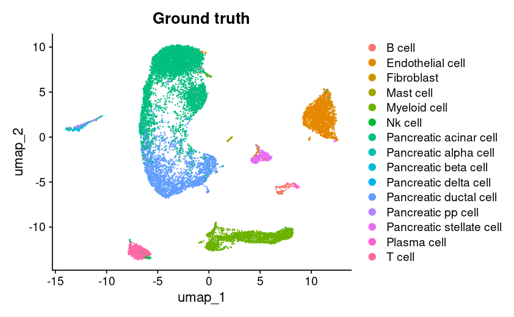
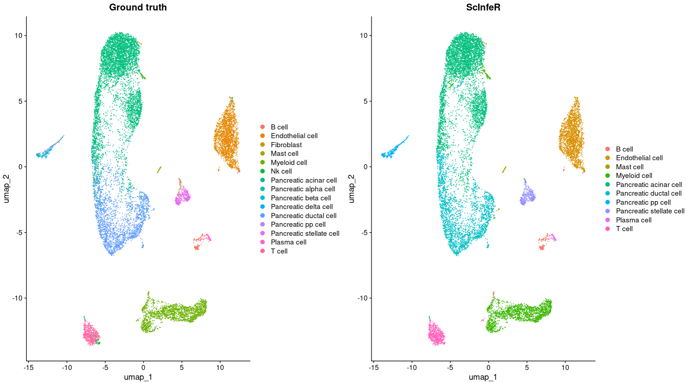
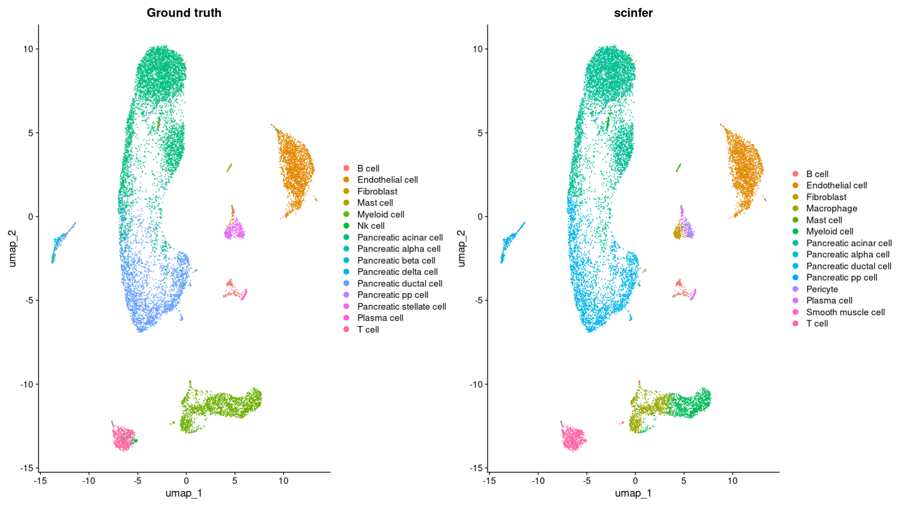
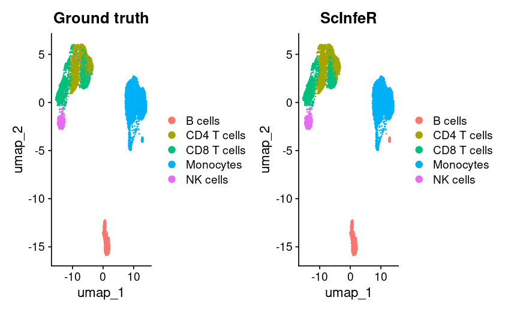
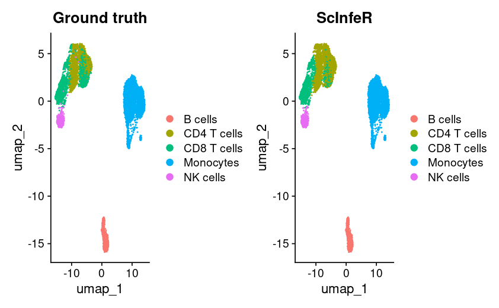
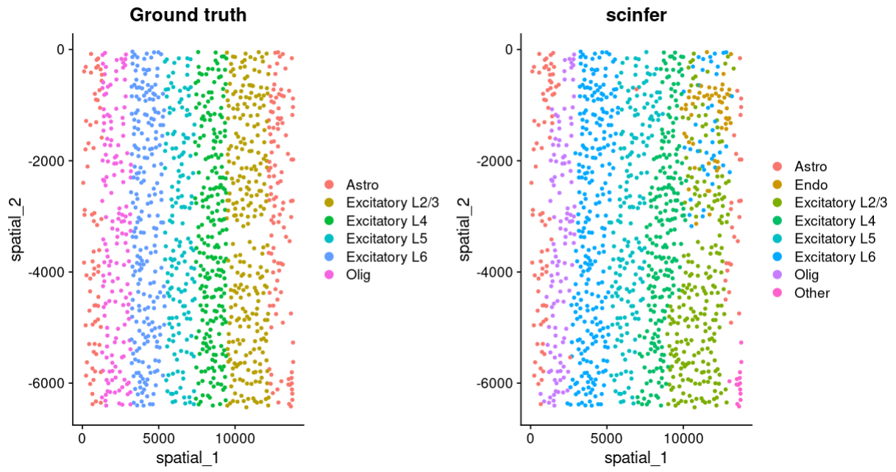

## About the tool
##### ScInfeR: a graph-based cell type annotation toolkit for single-cell RNA-seq, ATAC-seq, and spatial omics
##### Brief overview of the tool algorithm
1. ScInfeR can annotate cells using user-defined marker sets, scRNA-seq references, or both to annotate cells in scRNA-seq, scATAC-seq, and spatial omics datasets.  
2. ScInfeR implements two rounds of annotation strategy for cell-type assignment. 
3. First, the tool annotates the cell clusters by correlating the cluster-specific markers with the cell-type-specific markers in the cell-cell similarity graph. These cell-type-specific marker genes can be either user-defined, extracted by ScInfeR from scRNA-seq reference data, or a combination of both. For scRNA-seq as a reference, ScInfeR extracts cell-type markers by considering both the global and local specificity of markers. 
4. In the second round, the tool annotates the subtypes and clusters containing multiple cell types in a hierarchical manner. In this step, the tool uses a framework adapted from the message-passing layer in the graph neural network to annotate each cell individually.
### How to install 
#### using devtools
```
devtools::install_github("swainasish/ScInfeR")
```
#### Or you can load the R script as source
```
source("https://raw.githubusercontent.com/swainasish/ScInfeR/master/R/base.R")
```
## Annotate scRNA-seq datasets using marker-set
Load the libraries
```{r}
library(Seurat)
library(ScInfeR)
```
Load the dataset and pre-process using Seurat
```{r}
ts_pancreas <-  LoadSeuratRds("fig2_ts_pancreas.rds")
ts_pancreas  <- NormalizeData(ts_pancreas , normalization.method = "LogNormalize", scale.factor = 10000)
ts_pancreas  <- FindVariableFeatures(ts_pancreas , selection.method = "vst", nfeatures = 2000)
genes <- VariableFeatures(ts_pancreas )
ts_pancreas <- ScaleData(ts_pancreas , features = genes)
ts_pancreas  <- RunPCA(ts_pancreas , features = genes)
ts_pancreas  <- FindNeighbors(ts_pancreas , dims = 1:10)
ts_pancreas  <- FindClusters(ts_pancreas , resolution = 1)
ts_pancreas  <- RunUMAP(ts_pancreas , dims = 1:10)
ts_pancreas$"Ground truth" <- ts_pancreas$Celltype
DimPlot(ts_pancreas,reduction = "umap",group.by = "Ground truth")
```
 \
Fetch the marker-set from ScInfeRDB \
You can change the tissue type by change the argument
```{r}
scinfer_marker_pancreas <- fetch_markerset(tissue_type = "Pancreas")
```
Celltype annotation by ScInfeR, using marker-set as guidance
```{r}
scInfer_pred_pancreas_mar <- predict_celltype_scRNA_seurat(s_object = ts_pancreas ,
                                                       group_annt = ts_pancreas$seurat_clusters,
                                                       ct_marker_df = scinfer_marker_pancreas,
                                                       subtype_present = F,
                                                       subtype_info = F,
                                                       assay_name= "RNA",
                                                       slot_name = "counts",
                                                       own_weightage = 0.5,
                                                       n_neighbor=10)
ts_pancreas$ScInfeR <- scInfer_pred_pancreas_mar$celltype
scinfer_plot <- DimPlot(ts_pancreas,reduction = "umap",group.by = "ScInfeR")
gt+scinfer_plot
```
 

## Annotate scRNA-seq datasets using scRNA-seq reference or hybrid mode

```{r}
library(Seurat)
library(ScInfeR)
library(ggplot2)
```

Load the target dataset and pre-process
```{r}
ts_pancreas <-  LoadSeuratRds("fig2_ts_pancreas.rds")
ts_pancreas  <- NormalizeData(ts_pancreas , normalization.method = "LogNormalize", scale.factor = 10000)
ts_pancreas  <- FindVariableFeatures(ts_pancreas , selection.method = "vst", nfeatures = 2000)
genes <- VariableFeatures(ts_pancreas )
ts_pancreas <- ScaleData(ts_pancreas , features = genes)
ts_pancreas  <- RunPCA(ts_pancreas , features = genes)
ts_pancreas  <- FindNeighbors(ts_pancreas , dims = 1:10)
ts_pancreas  <- FindClusters(ts_pancreas , resolution = 1)
ts_pancreas  <- RunUMAP(ts_pancreas , dims = 1:10)
ts_pancreas$"Ground truth" <- ts_pancreas$Celltype
gt <- DimPlot(ts_pancreas,reduction = "umap",group.by = "Ground truth")
gt
```


Load the reference dataset and fetch markers from the reference dataset \
combined the markers fetched from reference dataset and markers from ScInfeRDB

```{r}
scinfer_marker_pancreas <- fetch_markerset(tissue_type = "Pancreas")
```
```{r}
scinferdb_pancreas <- fetch_scRNA_reference(tissue_type="Pancreas",path=F)
pancreas_marker <- get_marker_from_ref_matrix(exp_mat=scinferdb_pancreas@assays$RNA$counts,
                                           annotations=scinferdb_pancreas$Celltype,
                                           umap_cor=scinferdb_pancreas@reductions$umap@cell.embeddings,
                                           num_marker_per_ct=10)  
pancreas_marker_combined <- rbind(scinfer_marker_pancreas,pancreas_marker)
```
Predict the cell types
```{r}
scInfer_pred_pancreas_ref <- predict_celltype_scRNA_seurat(s_object = ts_pancreas ,
                                                           group_annt = ts_pancreas$seurat_clusters,
                                                           ct_marker_df =pancreas_marker_combined  ,
                                                           subtype_present = F,
                                                           subtype_info = F,
                                                           assay_name= "RNA",
                                                           slot_name = "counts",
                                                           own_weightage = 0.5,
                                                           n_neighbor=10)
ts_pancreas$"scinfer" <- scInfer_pred_pancreas_ref$celltype
scinfer_plot <- DimPlot(ts_pancreas,reduction = "umap",group.by = "scinfer")
gt+scinfer_plot
```


## Annotate scATAC-seq datsets

Load the libraries 
```{r}
library(Seurat)
library(ScInfeR)
library(ggplot2)
```
In the first part of this tutorial shows to annotate scATAC-seq dataset using scRNA-seq as reference \
in next part we annotate the same dataset using scATAC-seq as reference.
#### Annotate scATAC-seq dataset using scRNA-seq as reference
Here, Arch object and gene activity score are needed for the analysis.
```{r}
atac_GSE129785_arch <- readRDS("/scATAC/final_arch_objects/GSE129785.arch.rds")
atac_GSE129785_gene_activity <- LoadSeuratRds("/reproduce/fig3_gse129785_geneactivity.rds")
```
Next, the reference scRNA-seq dataset have to load 
```{r}
disco_ref_atac_pbmc <- LoadSeuratRds("/reproduce/fig3_disco_pbmc_atac_ref.rds")
```
annotate using ScInfeR \
In first step, quality markers fetched from the reference scRNA-seq, next annotation can be performed.
```{r}
pbmc_atac_marker <- get_marker_from_ref_matrix(exp_mat=disco_ref_atac_pbmc@assays$RNA$counts,
                                               annotations=disco_ref_atac_pbmc$Celltype, 
                                         umap_cor=disco_ref_atac_pbmc@reductions$umap@cell.embeddings,
                                               num_marker_per_ct=10)
```
```{r}
scInfer_pred_atac_ref<- predict_celltype_scATAC(gene_act_mat=atac_GSE129785_gene_activity@assays$RNA$counts,
                                                  group_annt=atac_GSE129785_arch$Clusters,
                                                  ct_marker_df=pbmc_atac_marker,
                                                  umap_cord=atac_GSE129785_arch@embeddings$UMAP$df)
```
plot
```{r}
atac_GSE129785_gene_activity@reductions$"umap" <- CreateDimReducObject(as.matrix(atac_GSE129785_arch@embeddings$UMAP$df),key = "umap",assay = "RNA")
atac_GSE129785_gene_activity$"Ground truth" <- atac_GSE129785_gene_activity$Celltype
atac_GSE129785_gene_activity$"ScInfeR" <- scInfer_pred_atac_ref$celltype
gt_plot <- DimPlot(atac_GSE129785_gene_activity,reduction = "umap",group.by = "Ground truth")
scinfer_plot <- DimPlot(atac_GSE129785_gene_activity,reduction = "umap",group.by = "ScInfeR")
gt_plot + scinfer_plot
```
 

#### Annotate scATAC-seq dataset using scATAC-seq as reference
Here quality markers are retrived from the scATAC-seq reference, as the tissue type is PBMC where cell types are highly similar to each other, n_local set at 2 and higher weight assigned to local_weightage. 
```{r}
atac_ref_arch <- readRDS("/scATAC/final_arch_objects/GSE123578.arch.rds")
atac_ref_gene_activity <- LoadSeuratRds("/reproduce/fig3_gse123578_geneacivity.rds")
atac_marker_123578 <- get_marker_from_ref_matrix(exp_mat=atac_ref_gene_activity@assays$RNA$counts,
                                              annotations=atac_ref_gene_activity$Celltype,
                                              umap_cor=atac_ref_arch@embeddings$UMAP$df,
                                              num_marker_per_ct=10,
                                              n_local = 2,
                                              auc_threshold=0.65,
                                              Local_weightage = 0.8) 
```
cell type annotaion
```{r}
scInfer_pred_atac_ref2<- predict_celltype_scATAC(gene_act_mat=atac_GSE129785_gene_activity@assays$RNA$counts,
                                                  group_annt=atac_GSE129785_arch$Clusters,
                                                  ct_marker_df=atac_marker_123578,
                                                  umap_cord=atac_GSE129785_arch@embeddings$UMAP$df)
```
plot
```{r}
atac_GSE129785_gene_activity$"Ground truth" <- atac_GSE129785_gene_activity$Celltype
atac_GSE129785_gene_activity$"ScInfeR" <- scInfer_pred_atac_ref2$celltype
gt_plot <- DimPlot(atac_GSE129785_gene_activity,reduction = "umap",group.by = "Ground truth")
scinfer_plot <- DimPlot(atac_GSE129785_gene_activity,reduction = "umap",group.by = "ScInfeR")
gt_plot + scinfer_plot
```


## Annotate spatial omics datasets

load the libraries
```{r}
library(Seurat)
library(ScInfeR)
library(ggplot2)
```
Load the datasets
```{r}
starmap_scrna <- LoadSeuratRds("fig4a_starmap_scrna.rds" )
starmap_spatial <- LoadSeuratRds("fig4a_starmap_spatial.rds")
```
Here, instead of seurat cluster we will use spatial domains obtained from our recently published tool SpatialPrompt \
In this case, user can user seurat clusters or the domains obtained from other tools also. \
Article link for SpatialPrompt: https://doi.org/10.1038/s42003-024-06349-5.
```{r}
spatial_prompt_domains <- read.csv("fig4a_starmap_sprompt_domains.csv",
                                   row.names = 1)
```
Fetch quality markers from scRNA-seq reference 
```{r}
common_genes = intersect(rownames(starmap_scrna),rownames(starmap_spatial))
starmap_scrna1 = starmap_scrna[common_genes,]
spatial_marker <- get_marker_from_ref_matrix(exp_mat=GetAssayData(starmap_scrna1),
                                             annotations=starmap_scrna1$celltype,
                                             umap_cor=starmap_scrna@reductions$umap@cell.embeddings,
                                             num_marker_per_ct=10)
```
Celltype prediction
```{r}
scInfer_pred_starmap <- predict_celltype_spatial(expression_matrix =GetAssayData(starmap_spatial),
                                        group_annt=spatial_prompt_domains$X0,
                                        ct_marker_df=spatial_marker,
                                        spatial_cord =starmap_spatial@reductions$spatial@cell.embeddings,
                                        subtype_present = F,
                                        subtype_info = F,
                                        own_weightage = 0.5,
                                        n_neighbor=10)
```
  Plots 
```{r}
starmap_spatial$"Ground truth" <- starmap_spatial$celltype
starmap_spatial$"scinfer" <- scInfer_pred_starmap$celltype
plot <- DimPlot(starmap_spatial,reduction = "spatial",group.by = c("Ground truth","scinfer"))
plot
```

  

