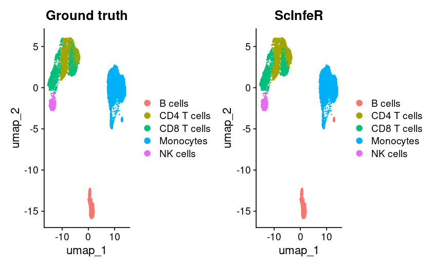
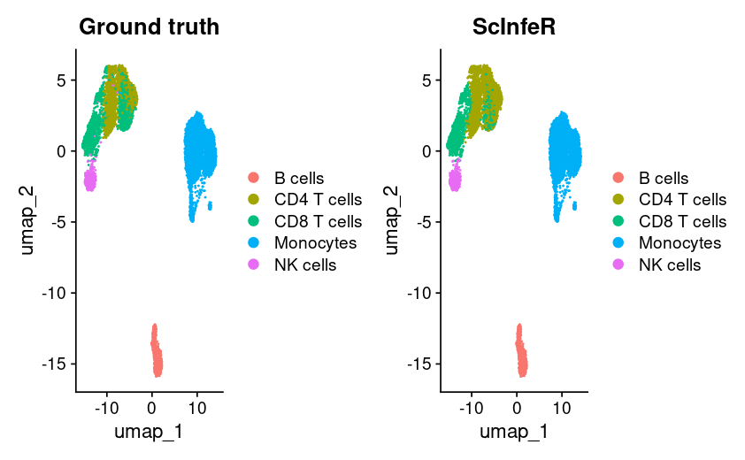

Load the libraries 
```{r}
library(Seurat)
library(ScInfeR)
library(ggplot2)
```
In the first part of this tutorial shows to annotate scATAC-seq dataset using scRNA-seq as reference \
in next part we annotate the same dataset using scATAC-seq as reference.
#### Annotate scATAC-seq dataset using scRNA-seq as reference
Here, Arch object and gene activity score are needed for the analysis.
```{r}
atac_GSE129785_arch <- readRDS("/scATAC/final_arch_objects/GSE129785.arch.rds")
atac_GSE129785_gene_activity <- LoadSeuratRds("/reproduce/fig3_gse129785_geneactivity.rds")
```
Next, the reference scRNA-seq dataset have to load 
```{r}
disco_ref_atac_pbmc <- LoadSeuratRds("/reproduce/fig3_disco_pbmc_atac_ref.rds")
```
annotate using ScInfeR \
In first step, quality markers fetched from the reference scRNA-seq, next annotation can be performed.
```{r}
pbmc_atac_marker <- get_marker_from_ref_matrix(exp_mat=disco_ref_atac_pbmc@assays$RNA$counts,
                                               annotations=disco_ref_atac_pbmc$Celltype, 
                                         umap_cor=disco_ref_atac_pbmc@reductions$umap@cell.embeddings,
                                               num_marker_per_ct=10)
```
```{r}
scInfer_pred_atac_ref<- predict_celltype_scATAC(gene_act_mat=atac_GSE129785_gene_activity@assays$RNA$counts,
                                                  group_annt=atac_GSE129785_arch$Clusters,
                                                  ct_marker_df=pbmc_atac_marker,
                                                  umap_cord=atac_GSE129785_arch@embeddings$UMAP$df)
```
plot
```{r}
atac_GSE129785_gene_activity@reductions$"umap" <- CreateDimReducObject(as.matrix(atac_GSE129785_arch@embeddings$UMAP$df),key = "umap",assay = "RNA")
atac_GSE129785_gene_activity$"Ground truth" <- atac_GSE129785_gene_activity$Celltype
atac_GSE129785_gene_activity$"ScInfeR" <- scInfer_pred_atac_ref$celltype
gt_plot <- DimPlot(atac_GSE129785_gene_activity,reduction = "umap",group.by = "Ground truth")
scinfer_plot <- DimPlot(atac_GSE129785_gene_activity,reduction = "umap",group.by = "ScInfeR")
gt_plot + scinfer_plot
```
 

#### Annotate scATAC-seq dataset using scATAC-seq as reference
Here quality markers are retrived from the scATAC-seq reference, as the tissue type is PBMC where cell types are highly similar to each other, n_local set at 2 and higher weight assigned to local_weightage. 
```{r}
atac_ref_arch <- readRDS("/scATAC/final_arch_objects/GSE123578.arch.rds")
atac_ref_gene_activity <- LoadSeuratRds("/reproduce/fig3_gse123578_geneacivity.rds")
atac_marker_123578 <- get_marker_from_ref_matrix(exp_mat=atac_ref_gene_activity@assays$RNA$counts,
                                              annotations=atac_ref_gene_activity$Celltype,
                                              umap_cor=atac_ref_arch@embeddings$UMAP$df,
                                              num_marker_per_ct=10,
                                              n_local = 2,
                                              auc_threshold=0.65,
                                              Local_weightage = 0.8) 
```
cell type annotaion
```{r}
scInfer_pred_atac_ref2<- predict_celltype_scATAC(gene_act_mat=atac_GSE129785_gene_activity@assays$RNA$counts,
                                                  group_annt=atac_GSE129785_arch$Clusters,
                                                  ct_marker_df=atac_marker_123578,
                                                  umap_cord=atac_GSE129785_arch@embeddings$UMAP$df)
```
plot
```{r}
atac_GSE129785_gene_activity$"Ground truth" <- atac_GSE129785_gene_activity$Celltype
atac_GSE129785_gene_activity$"ScInfeR" <- scInfer_pred_atac_ref2$celltype
gt_plot <- DimPlot(atac_GSE129785_gene_activity,reduction = "umap",group.by = "Ground truth")
scinfer_plot <- DimPlot(atac_GSE129785_gene_activity,reduction = "umap",group.by = "ScInfeR")
gt_plot + scinfer_plot
```



