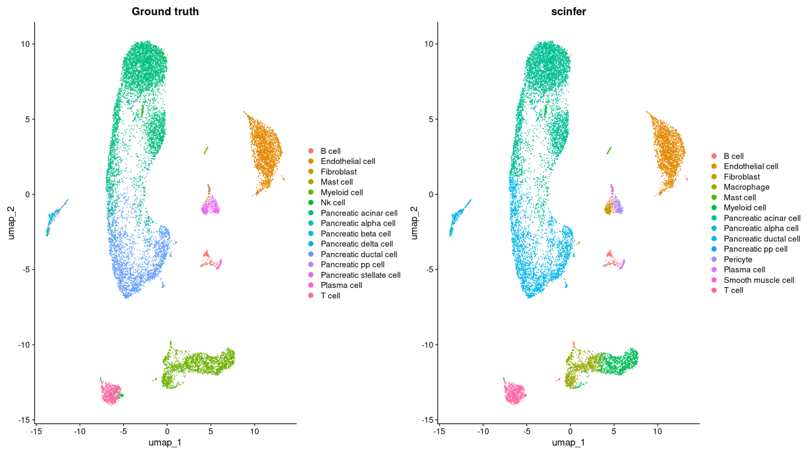

```{r}
library(Seurat)
library(ScInfeR)
library(ggplot2)
```

Load the target dataset and pre-process
```{r}
ts_pancreas <-  LoadSeuratRds("fig2_ts_pancreas.rds")
ts_pancreas  <- NormalizeData(ts_pancreas , normalization.method = "LogNormalize", scale.factor = 10000)
ts_pancreas  <- FindVariableFeatures(ts_pancreas , selection.method = "vst", nfeatures = 2000)
genes <- VariableFeatures(ts_pancreas )
ts_pancreas <- ScaleData(ts_pancreas , features = genes)
ts_pancreas  <- RunPCA(ts_pancreas , features = genes)
ts_pancreas  <- FindNeighbors(ts_pancreas , dims = 1:10)
ts_pancreas  <- FindClusters(ts_pancreas , resolution = 1)
ts_pancreas  <- RunUMAP(ts_pancreas , dims = 1:10)
ts_pancreas$"Ground truth" <- ts_pancreas$Celltype
gt <- DimPlot(ts_pancreas,reduction = "umap",group.by = "Ground truth")
gt
```


Load the reference dataset and fetch markers from the reference dataset \
combined the markers fetched from reference dataset and markers from ScInfeRDB

```{r}
scinfer_marker_pancreas <- readxl::read_excel("scinfer_combined_hs.xlsx", sheet = "Pancreas")
scinfer_marker_pancreas <- scinfer_marker_pancreas[,c("celltype","marker","weight")]
```
```{r}
scinferdb_pancreas <- LoadSeuratRds("/ScInfeR_pancreas.rds")
pancreas_marker <- get_marker_from_ref_matrix(exp_mat=scinferdb_pancreas@assays$RNA$counts,
                                           annotations=scinferdb_pancreas$Celltype,
                                           umap_cor=scinferdb_pancreas@reductions$umap@cell.embeddings,
                                           num_marker_per_ct=10)  
pancreas_marker_combined <- rbind(scinfer_marker_pancreas,pancreas_marker)
```
Predict the cell types
```{r}
scInfer_pred_pancreas_ref <- predict_celltype_scRNA_seurat(s_object = ts_pancreas ,
                                                           group_annt = ts_pancreas$seurat_clusters,
                                                           ct_marker_df =pancreas_marker_combined  ,
                                                           subtype_present = F,
                                                           subtype_info = F,
                                                           assay_name= "RNA",
                                                           slot_name = "counts",
                                                           own_weightage = 0.5,
                                                           n_neighbor=10)
ts_pancreas$"scinfer" <- scInfer_pred_pancreas_ref$celltype
scinfer_plot <- DimPlot(ts_pancreas,reduction = "umap",group.by = "scinfer")
gt+scinfer_plot
```
