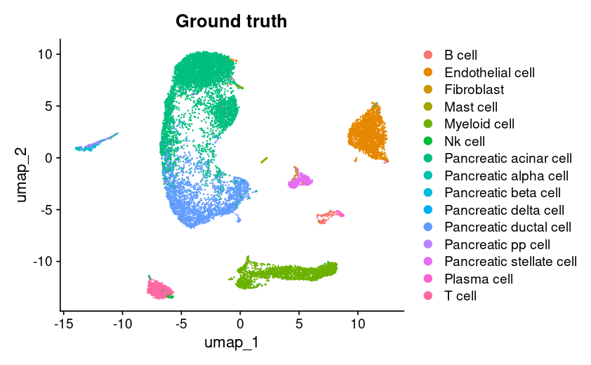
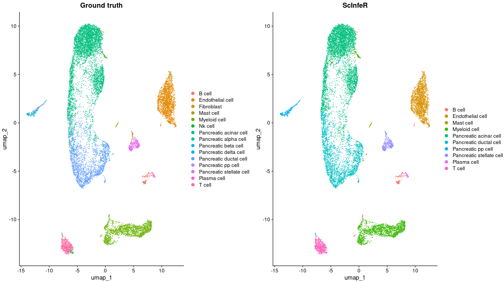

Load the libraries
```{r}
library(Seurat)
library(ScInfeR)
```
Load the dataset and pre-process using Seurat
```{r}
ts_pancreas <-  LoadSeuratRds("fig2_ts_pancreas.rds")
ts_pancreas  <- NormalizeData(ts_pancreas , normalization.method = "LogNormalize", scale.factor = 10000)
ts_pancreas  <- FindVariableFeatures(ts_pancreas , selection.method = "vst", nfeatures = 2000)
genes <- VariableFeatures(ts_pancreas )
ts_pancreas <- ScaleData(ts_pancreas , features = genes)
ts_pancreas  <- RunPCA(ts_pancreas , features = genes)
ts_pancreas  <- FindNeighbors(ts_pancreas , dims = 1:10)
ts_pancreas  <- FindClusters(ts_pancreas , resolution = 1)
ts_pancreas  <- RunUMAP(ts_pancreas , dims = 1:10)
ts_pancreas$"Ground truth" <- ts_pancreas$Celltype
DimPlot(ts_pancreas,reduction = "umap",group.by = "Ground truth")
```
 \
Fetch the marker-set from ScInfeRDB \
You can change the tissue type by change the argument
```{r}
scinfer_marker_pancreas <- fetch_markerset(tissue_type = "Pancreas")
```
Celltype annotation by ScInfeR, using marker-set as guidance
```{r}
scInfer_pred_pancreas_mar <- predict_celltype_scRNA_seurat(s_object = ts_pancreas ,
                                                       group_annt = ts_pancreas$seurat_clusters,
                                                       ct_marker_df = scinfer_marker_pancreas,
                                                       subtype_present = F,
                                                       subtype_info = F,
                                                       assay_name= "RNA",
                                                       slot_name = "counts",
                                                       own_weightage = 0.5,
                                                       n_neighbor=10)
ts_pancreas$ScInfeR <- scInfer_pred_pancreas_mar$celltype
scinfer_plot <- DimPlot(ts_pancreas,reduction = "umap",group.by = "ScInfeR")
gt+scinfer_plot
```
 
