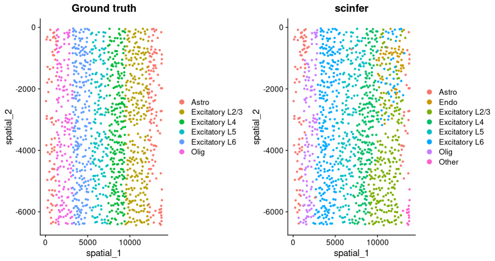

load the libraries
```{r}
library(Seurat)
library(ScInfeR)
library(ggplot2)
```
Load the datasets
```{r}
starmap_scrna <- LoadSeuratRds("fig4a_starmap_scrna.rds" )
starmap_spatial <- LoadSeuratRds("fig4a_starmap_spatial.rds")
```
Here, instead of seurat cluster we will use spatial domains obtained from our recently published tool SpatialPrompt \
In this case, user can user seurat clusters or the domains obtained from other tools also. \
Article link for SpatialPrompt: https://doi.org/10.1038/s42003-024-06349-5.
```{r}
spatial_prompt_domains <- read.csv("fig4a_starmap_sprompt_domains.csv",
                                   row.names = 1)
```
Fetch quality markers from scRNA-seq reference 
```{r}
common_genes = intersect(rownames(starmap_scrna),rownames(starmap_spatial))
starmap_scrna1 = starmap_scrna[common_genes,]
spatial_marker <- get_marker_from_ref_matrix(exp_mat=GetAssayData(starmap_scrna1),
                                             annotations=starmap_scrna1$celltype,
                                             umap_cor=starmap_scrna@reductions$umap@cell.embeddings,
                                             num_marker_per_ct=10)
```
Celltype prediction
```{r}
scInfer_pred_starmap <- predict_celltype_spatial(expression_matrix =GetAssayData(starmap_spatial),
                                        group_annt=spatial_prompt_domains$X0,
                                        ct_marker_df=spatial_marker,
                                        spatial_cord =starmap_spatial@reductions$spatial@cell.embeddings,
                                        subtype_present = F,
                                        subtype_info = F,
                                        own_weightage = 0.5,
                                        n_neighbor=10)
```
  Plots 
```{r}
starmap_spatial$"Ground truth" <- starmap_spatial$celltype
starmap_spatial$"scinfer" <- scInfer_pred_starmap$celltype
plot <- DimPlot(starmap_spatial,reduction = "spatial",group.by = c("Ground truth","scinfer"))
plot
```

  

